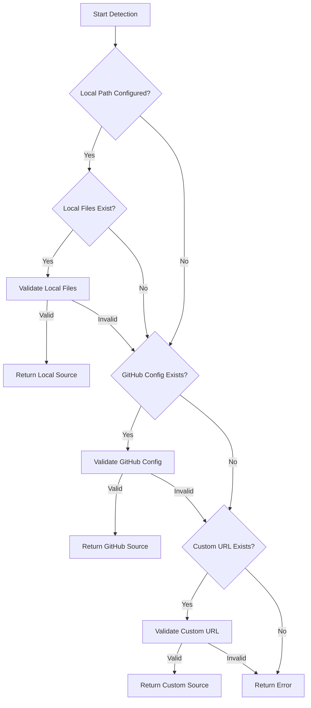

# SOP Source Detector Guide

**Version:** 1.0.0  
**Date:** 2025-12-23  
**Status:** Production Ready  
**Purpose:** Guide for AI agents on implementing smart source detection logic

---

## Overview

This guide documents the smart source detection algorithm that AI agents should implement when executing the `/generate-agents-md` slash command. The detection logic determines the best available source for SOP files (local files, GitHub, or custom URL) and handles fallback scenarios.

**Key Principle:** Always check local files first (fastest, works offline), then fallback to remote sources (GitHub, custom URL).

---

## Detection Algorithm

### Pseudo-Code

```
function detectSOPSource(config):
    // Step 1: Check local files
    if config.local.base_path exists:
        if validateLocalFiles(config.local.base_path):
            return { source: "local", path: config.local.base_path }
    
    // Step 2: Check GitHub configuration
    if config.github exists:
        if validateGitHubConfig(config.github):
            return { source: "github", config: config.github }
    
    // Step 3: Check custom URL
    if config.custom.base_url exists:
        if validateCustomURL(config.custom.base_url):
            return { source: "custom", url: config.custom.base_url }
    
    // Step 4: All sources failed
    return { source: "error", message: "No valid SOP source found" }
```

### Detection Flow



---

## Step 1: Local File Detection

### 1.1 Check Local Path

**Check if configured:**
- Look for `sop_source.local.base_path` in command configuration
- If not configured, skip to Step 2

**Example Configuration:**
```yaml
sop_source:
  local:
    base_path: "__ref/SOPs/agents-md-generator"
```

### 1.2 Validate Local Files

**Required Files to Check:**

**Directives (must exist):**
- `{base_path}/directives/MISSION-OBJECTIVES.md`
- `{base_path}/directives/TASKER-ORDERS.md`
- `{base_path}/directives/AGENTS-MD-TEMPLATE.md`
- `{base_path}/directives/VALIDATION-CHECKLIST.md`

**Scripts (must exist):**
- `{base_path}/executions/analyze-folder.py`
- `{base_path}/executions/extract-context.py`
- `{base_path}/executions/validate-agents-md.py`
- `{base_path}/executions/check-existing-agents-md.py`

**Validation Logic:**
```python
def validateLocalFiles(base_path):
    required_directives = [
        "directives/MISSION-OBJECTIVES.md",
        "directives/TASKER-ORDERS.md",
        "directives/AGENTS-MD-TEMPLATE.md",
        "directives/VALIDATION-CHECKLIST.md"
    ]
    
    required_scripts = [
        "executions/analyze-folder.py",
        "executions/extract-context.py",
        "executions/validate-agents-md.py",
        "executions/check-existing-agents-md.py"
    ]
    
    # Check all required files exist
    for file in required_directives + required_scripts:
        if not os.path.exists(f"{base_path}/{file}"):
            return False
    
    return True
```

**Implementation Notes:**
- Use `read_file` tool to check file existence
- Check all required files (not just one)
- Return `True` only if all files exist
- Return `False` if any file missing (triggers fallback)

### 1.3 Return Local Source

**If validation passes:**
```javascript
{
    source: "local",
    base_path: "__ref/SOPs/agents-md-generator",
    type: "local"
}
```

**Advantages:**
- Fastest access (no network)
- Works offline
- No authentication needed
- Most reliable

---

## Step 2: GitHub Source Detection

### 2.1 Check GitHub Configuration

**Check if configured:**
- Look for `sop_source.github` in command configuration
- If not configured, skip to Step 3

**Example Configuration:**
```yaml
sop_source:
  github:
    user: "your-username"
    repo: "agents-md-generator"
    branch: "main"
```

### 2.2 Validate GitHub Config

**Required Fields:**
- `user` (GitHub username or organization)
- `repo` (repository name)
- `branch` (branch name or tag, e.g., "main" or "v1.1.0")

**Validation Logic:**
```python
def validateGitHubConfig(github_config):
    required_fields = ["user", "repo", "branch"]
    
    for field in required_fields:
        if field not in github_config:
            return False
        if not github_config[field] or github_config[field].strip() == "":
            return False
    
    return True
```

**Implementation Notes:**
- Check all required fields exist
- Check fields are not empty
- Don't validate URL accessibility yet (do that during fetch)

### 2.3 Construct Base URL

**URL Format:**
```
https://raw.githubusercontent.com/{user}/{repo}/{branch}/__ref/SOPs/agents-md-generator/
```

**Example:**
```
https://raw.githubusercontent.com/your-username/agents-md-generator/main/__ref/SOPs/agents-md-generator/
```

**Implementation:**
```python
def constructGitHubBaseURL(config):
    user = config["user"]
    repo = config["repo"]
    branch = config["branch"]
    
    return f"https://raw.githubusercontent.com/{user}/{repo}/{branch}/__ref/SOPs/agents-md-generator/"
```

### 2.4 Return GitHub Source

**If validation passes:**
```javascript
{
    source: "github",
    base_url: "https://raw.githubusercontent.com/user/repo/branch/__ref/SOPs/agents-md-generator/",
    user: "your-username",
    repo: "agents-md-generator",
    branch: "main",
    type: "github"
}
```

**Advantages:**
- Works in any repository
- Version-controlled
- No local files needed
- Free (public repos)

**Disadvantages:**
- Requires internet access
- Slightly slower than local
- May fail if GitHub unavailable

---

## Step 3: Custom URL Detection

### 3.1 Check Custom URL Configuration

**Check if configured:**
- Look for `sop_source.custom.base_url` in command configuration
- If not configured, proceed to error handling

**Example Configuration:**
```yaml
sop_source:
  custom:
    base_url: "https://your-domain.com/agents-md-generator/"
```

### 3.2 Validate Custom URL

**Validation Logic:**
```python
def validateCustomURL(base_url):
    # Check URL format
    if not base_url.startswith("http://") and not base_url.startswith("https://"):
        return False
    
    # Check URL is not empty
    if not base_url or base_url.strip() == "":
        return False
    
    return True
```

**Implementation Notes:**
- Validate URL format (must start with http:// or https://)
- Don't test accessibility yet (do that during fetch)
- Allow trailing slash (normalize if needed)

### 3.3 Return Custom Source

**If validation passes:**
```javascript
{
    source: "custom",
    base_url: "https://your-domain.com/agents-md-generator/",
    type: "custom"
}
```

**Advantages:**
- Self-hosted solutions
- Enterprise deployments
- Custom CDN/mirror

**Disadvantages:**
- Requires custom infrastructure
- May require authentication
- Less standardized

---

## Step 4: Error Handling

### 4.1 No Valid Source Found

**If all sources fail:**
```javascript
{
    source: "error",
    message: "No valid SOP source found. Please configure local.base_path, github, or custom.base_url",
    details: {
        local_checked: true/false,
        github_checked: true/false,
        custom_checked: true/false
    }
}
```

### 4.2 Error Messages

**Standardized Error Messages:**

1. **No Configuration:**
   ```
   Error: SOP source not configured. Please add sop_source configuration to command definition.
   ```

2. **Local Files Missing:**
   ```
   Error: Local SOP files not found at {base_path}. Required files missing. Falling back to GitHub...
   ```

3. **GitHub Config Invalid:**
   ```
   Error: GitHub configuration invalid. Missing required fields: {missing_fields}
   ```

4. **All Sources Failed:**
   ```
   Error: No valid SOP source found. Please configure at least one source (local, github, or custom).
   ```

### 4.3 Fallback Behavior

**Fallback Sequence:**
1. Try local files first (if configured)
2. If local fails, try GitHub (if configured)
3. If GitHub fails, try custom URL (if configured)
4. If all fail, report error and stop execution

**Important:** Don't fail silently - always report which sources were tried and why they failed.

---

## Implementation Example

### Complete Detection Function

```python
def detectSOPSource(config):
    """
    Detect the best available SOP source.
    
    Returns:
        dict: Source information with type, path/url, and metadata
    """
    # Step 1: Check local files
    if "local" in config and "base_path" in config["local"]:
        base_path = config["local"]["base_path"]
        if validateLocalFiles(base_path):
            return {
                "source": "local",
                "base_path": base_path,
                "type": "local"
            }
        else:
            # Log warning but continue to fallback
            log_warning(f"Local files not found at {base_path}, trying fallback...")
    
    # Step 2: Check GitHub
    if "github" in config:
        github_config = config["github"]
        if validateGitHubConfig(github_config):
            base_url = constructGitHubBaseURL(github_config)
            return {
                "source": "github",
                "base_url": base_url,
                "user": github_config["user"],
                "repo": github_config["repo"],
                "branch": github_config["branch"],
                "type": "github"
            }
        else:
            log_warning("GitHub configuration invalid, trying fallback...")
    
    # Step 3: Check custom URL
    if "custom" in config and "base_url" in config["custom"]:
        base_url = config["custom"]["base_url"]
        if validateCustomURL(base_url):
            return {
                "source": "custom",
                "base_url": base_url,
                "type": "custom"
            }
        else:
            log_warning("Custom URL invalid...")
    
    # Step 4: All sources failed
    return {
        "source": "error",
        "message": "No valid SOP source found",
        "details": {
            "local_checked": "local" in config,
            "github_checked": "github" in config,
            "custom_checked": "custom" in config
        }
    }
```

---

## Usage in Slash Command Execution

### Integration Point

**When to call:**
- At the start of `/generate-agents-md` command execution
- Before PRE-FLIGHT phase
- Once per command execution

**Example Usage:**
```python
# Read command configuration
config = read_command_config()

# Detect SOP source
source_info = detectSOPSource(config["sop_source"])

# Handle source
if source_info["source"] == "error":
    report_error(source_info["message"])
    exit(1)

# Use source_info to fetch files
if source_info["type"] == "local":
    # Read files from local path
    directives = read_local_files(source_info["base_path"])
elif source_info["type"] == "github":
    # Fetch files from GitHub
    directives = fetch_from_github(source_info["base_url"])
elif source_info["type"] == "custom":
    # Fetch files from custom URL
    directives = fetch_from_custom(source_info["base_url"])
```

---

## Best Practices

### 1. Always Check Local First
- Local files are fastest and most reliable
- Works offline
- No network latency

### 2. Validate Before Using
- Don't assume files exist
- Check all required files
- Verify configuration is complete

### 3. Clear Error Messages
- Tell user which sources were checked
- Explain why each source failed
- Suggest solutions

### 4. Log Fallback Attempts
- Log when falling back from local to GitHub
- Help with debugging
- Provide transparency

### 5. Cache Source Decision
- Once detected, reuse for entire execution
- Don't re-detect for each file
- Store source_info for later use

---

## Testing

### Test Cases

1. **Local Only:**
   - Configure local path with valid files
   - Verify local source detected
   - Verify no GitHub fetch attempted

2. **GitHub Only:**
   - Configure GitHub without local
   - Verify GitHub source detected
   - Verify URL constructed correctly

3. **Hybrid (Local + GitHub):**
   - Configure both local and GitHub
   - Remove local files
   - Verify fallback to GitHub

4. **All Sources Fail:**
   - Configure invalid sources
   - Verify error message
   - Verify execution stops

5. **No Configuration:**
   - No sop_source config
   - Verify error message
   - Verify helpful suggestions

---

## Troubleshooting

### Issue: Local Files Not Detected

**Check:**
- File paths are correct (case-sensitive)
- All required files exist
- File permissions allow reading
- Base path is relative to project root

### Issue: GitHub Config Invalid

**Check:**
- All required fields present (user, repo, branch)
- Fields are not empty
- No typos in field names
- Branch/tag exists in repository

### Issue: Custom URL Invalid

**Check:**
- URL starts with http:// or https://
- URL is not empty
- URL is accessible (test separately)

---

## References

- [File Fetching Guide](./file-fetching-guide.md) - How to fetch files from detected source
- [GitHub Setup Guide](./GITHUB_SETUP.md) - How to set up GitHub repository
- [Slash Command Universal](./cursor-slash-command-universal.md) - Command configuration

---

**Version:** 1.0.0  
**Last Updated:** 2025-12-23  
**Status:** Production Ready  
**Next:** Use with file fetching guide to complete implementation

